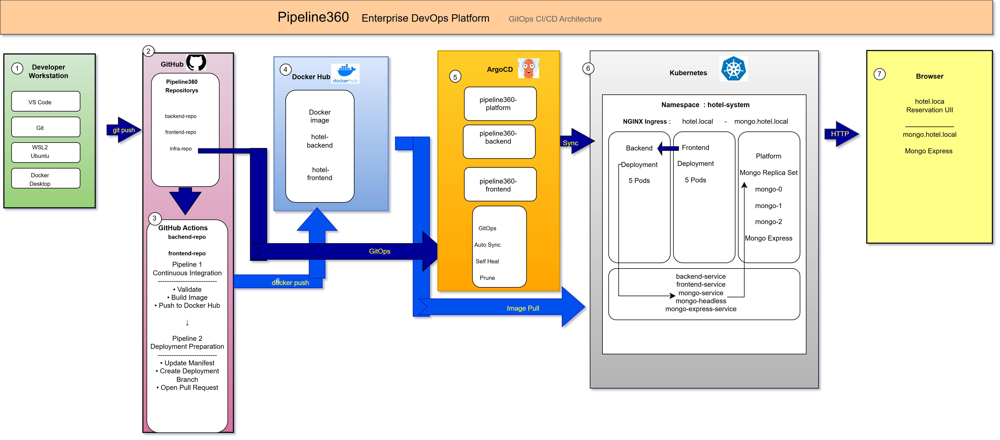

# Pipeline360 Infrastructure

## Overview

Pipeline360 is a cloud-native hotel reservation platform designed to demonstrate a complete modern DevOps workflow.

The project implements a full GitOps deployment model using Kubernetes, Docker, GitHub Actions and Argo CD.

Unlike traditional application repositories, this repository serves as the **single source of truth** for the desired infrastructure state of the entire platform.

All Kubernetes manifests, GitOps configuration, Argo CD Applications and deployment definitions are maintained here.

Whenever infrastructure changes are merged into the `main` branch, Argo CD automatically synchronizes the Kubernetes cluster with the desired state.

---

## System Architecture

<p alige ="center">
  
</p>

<p alige ="center">
  <em>Pipeline360 — GitOps CI/CD and Kubernetes Architecture</em>
</p>

---


# Project Objectives

The project demonstrates the implementation of a complete cloud-native software delivery pipeline.

Main objectives:

- Build containerized applications
- Automate Continuous Integration
- Automate Deployment Preparation
- Implement GitOps
- Deploy to Kubernetes
- Manage MongoDB using StatefulSets
- Deploy applications using Argo CD
- Perform zero-downtime Rolling Updates
- Maintain Infrastructure as Code

---

# Project Architecture

Pipeline360 consists of three independent Git repositories.

```text
                    Pipeline360
                         │
     ┌───────────────────┼───────────────────┐
     │                   │                   │
     ▼                   ▼                   ▼
Frontend Repo      Backend Repo        Infrastructure Repo
     │                   │                   │
     │                   │                   │
Docker Image       Docker Image        Kubernetes
     │                   │             Argo CD
     └──────────────┬────┘             GitOps
                    │
                    ▼
               Docker Hub
                    │
                    ▼
          Pipeline360-Infra
                    │
                    ▼
                 Argo CD
                    │
                    ▼
               Kubernetes
```

---

# Repository Responsibilities

## Pipeline360-Frontend

Responsible for:

- HTML
- CSS
- JavaScript
- NGINX configuration
- Docker image
- Frontend CI
- Deployment Preparation workflow

---

## Pipeline360-Backend

Responsible for:

- Node.js
- Express REST API
- MongoDB integration
- Docker image
- Backend CI
- Deployment Preparation workflow

---

## Pipeline360-Infra

Responsible for:

- Kubernetes manifests
- Namespaces
- Deployments
- Services
- Ingress
- ConfigMaps
- Secrets templates
- MongoDB StatefulSet
- Argo CD Applications
- Infrastructure validation
- GitOps deployment

This repository is the **single source of truth** for the desired Kubernetes state.

---

# Repository Structure

```text
Pipeline360-Infra/
│
├── .github/
│   └── workflows/
│       └── infra-validation.yaml
│
├── argocd/
│   ├── backend-app.yaml
│   ├── frontend-app.yaml
│   ├── platform-app.yaml
│   └── application.yaml
│
├── kubernetes/
│   ├── backend/
│   ├── frontend/
│   ├── platform/
│   └── secrets/
│
├── docs/
│   ├── architecture.drawio
│   └── architecture.png
│
└── README.md
```

---

# Technology Stack

| Area | Technology |
|------|------------|
| Operating System | Ubuntu (WSL2) |
| Container Runtime | Docker Desktop |
| Container Platform | Kubernetes (Kind) |
| GitOps | Argo CD |
| CI/CD | GitHub Actions |
| Database | MongoDB Replica Set |
| Reverse Proxy | NGINX Ingress |
| Container Registry | Docker Hub |
| Source Control | GitHub |
| Backend | Node.js + Express |
| Frontend | HTML + CSS + JavaScript |

---

# Design Principles

The project was designed according to the following principles:

- Infrastructure as Code
- GitOps
- Immutable Docker Images
- Pull Request based deployments
- Separation of responsibilities
- Independent repositories
- Reproducible deployments
- Automated validation
- Rolling updates
- High availability where applicable

---

# Kubernetes Architecture

Pipeline360 is deployed on a Kubernetes cluster running on **Kind (Kubernetes in Docker)**.

The cluster hosts all application workloads together with the supporting infrastructure required for GitOps deployment.

Current namespace:

```text
hotel-system
```

All application resources are deployed inside this namespace.

---

# Infrastructure Components

The platform consists of the following Kubernetes resources.

| Component | Purpose |
|-----------|---------|
| Frontend Deployment | Serves the web application |
| Backend Deployment | Hosts the REST API |
| MongoDB StatefulSet | Persistent database |
| Mongo Headless Service | Replica Set communication |
| Mongo Service | Internal MongoDB access |
| Mongo Express | Database administration |
| ConfigMap | Application configuration |
| Secret Templates | Sensitive configuration templates |
| Ingress | External HTTP routing |

---

# Frontend Deployment

The frontend is deployed as a Kubernetes Deployment.

Deployment:

```text
frontend-deployment
```

Responsibilities:

- Serve the static application
- Proxy API requests through NGINX
- Participate in Rolling Updates
- Support horizontal scaling

Current configuration:

| Property | Value |
|----------|-------|
| Replicas | 5 |
| Container Port | 80 |
| Service | frontend-service |

Health probes:

```text
/index.html
```

---

# Backend Deployment

The backend is deployed as a Kubernetes Deployment.

Deployment:

```text
backend-deployment
```

Responsibilities:

- Process REST API requests
- Validate reservations
- Communicate with MongoDB
- Expose health endpoints

Current configuration:

| Property | Value |
|----------|-------|
| Replicas | 5 |
| Container Port | 3000 |
| Service | backend-service |

Health endpoints:

```text
GET /health
GET /ready
```

---

# MongoDB

Pipeline360 uses MongoDB as the primary database.

MongoDB is deployed as a Kubernetes StatefulSet rather than a Deployment.

Deployment type:

```text
StatefulSet
```

Benefits:

- Stable Pod identity
- Persistent storage
- Ordered startup
- Ordered shutdown
- Replica Set support

Current replicas:

```text
mongo-0
mongo-1
mongo-2
```

Replica Set:

```text
rs0
```

---

# MongoDB Headless Service

The Replica Set members communicate using a Headless Service.

Service:

```text
mongo-headless
```

Purpose:

- Stable DNS names
- Internal replica communication
- Replica discovery

Example DNS:

```text
mongo-0.mongo-headless.hotel-system.svc.cluster.local
```

---

# MongoDB Service

The backend connects to MongoDB through:

```text
mongo
```

Service type:

```text
ClusterIP
```

Purpose:

- Internal database access
- Stable service endpoint

---

# Mongo Express

Mongo Express provides a web interface for MongoDB administration.

Deployment:

```text
mongo-express
```

Responsibilities:

- Browse collections
- Inspect documents
- Verify Replica Set data
- Administrative access

Authentication is provided through Kubernetes Secrets.

---

# ConfigMap

Application configuration is stored inside:

```text
kubernetes/platform/app-config.yaml
```

Typical configuration includes:

- MongoDB connection string
- Environment variables
- Application settings

Using ConfigMaps separates configuration from application code.

---

# Secrets

Sensitive configuration is never committed directly to Git.

Instead, this repository contains Secret templates.

Example:

```text
kubernetes/secrets/db-secrets.yaml.template
```

Sensitive values are created inside the Kubernetes cluster during deployment.

Examples include:

- Credentials
- Passwords
- Tokens

---

# Services

The platform uses Kubernetes Services to provide stable networking.

| Service | Type | Purpose |
|---------|------|---------|
| frontend-service | ClusterIP | Frontend access |
| backend-service | ClusterIP | Backend REST API |
| mongo | ClusterIP | MongoDB access |
| mongo-headless | Headless | Replica Set communication |
| mongo-express-service | ClusterIP | Mongo Express |

Services provide stable virtual IP addresses regardless of Pod lifecycle.

---

# Ingress

External traffic enters the cluster through an NGINX Ingress.

Ingress:

```text
hotel-ingress
```

Responsibilities:

- Route browser requests
- Route API requests
- Present a single application endpoint

Routing rules:

```text
/
        ▼
frontend-service

/api
        ▼
backend-service
```

Development URL:

```text
http://hotel.local:3000
```

The Windows hosts file maps:

```text
127.0.0.1 hotel.local
```

This allows the browser to access the complete application through a single hostname.

---

# Network Architecture

The application network flow is illustrated below.

```text
Browser
   │
   ▼
NGINX Ingress
   │
   ├──────────────► Frontend Service
   │                     │
   │                     ▼
   │              Frontend Pods
   │
   ▼
Backend Service
   │
   ▼
Backend Pods
   │
   ▼
Mongo Service
   │
   ▼
Mongo Replica Set
```

The browser never communicates directly with MongoDB.

All data access is performed through the Backend REST API.

---

# Continuous Integration and Continuous Delivery

Pipeline360 implements a two-stage CI/CD architecture.

The CI/CD process is intentionally divided into two independent pipelines.

This separation provides:

- Better maintainability
- Clear separation of responsibilities
- Easier troubleshooting
- GitOps compliance
- Infrastructure review before deployment

---

# CI/CD Architecture

```text
Developer
     │
     ▼
Push to dev
     │
     ▼
────────────────────────────────────
Pipeline 1
Continuous Integration
────────────────────────────────────
     │
     ▼
Validate Source Code
     │
     ▼
Build Docker Image
     │
     ▼
Push Image to Docker Hub
     │
     ▼
────────────────────────────────────
Pipeline 2
Deployment Preparation
────────────────────────────────────
     │
     ▼
Update Kubernetes Manifest
     │
     ▼
Create Deployment Branch
     │
     ▼
Open Pull Request
     │
     ▼
Code Review
     │
     ▼
Merge to main
     │
     ▼
────────────────────────────────────
Argo CD
────────────────────────────────────
     │
     ▼
Synchronize Cluster
     │
     ▼
Rolling Update
```

---

# Pipeline 1 – Continuous Integration

The first pipeline is responsible for application validation and image creation.

Repositories:

- Pipeline360-Frontend
- Pipeline360-Backend

Workflow:

```text
.github/workflows/ci.yaml
```

Trigger:

```text
Push → dev branch
```

Responsibilities:

- Validate repository structure
- Install dependencies
- Execute application validation
- Build Docker image
- Authenticate to Docker Hub
- Push immutable image
- Update latest tag

Generated image tags:

Frontend:

```text
frontend-N
```

Backend:

```text
backend-N
```

Where **N** represents the GitHub Actions workflow run number.

---

# Docker Hub

The project publishes Docker images automatically.

Repositories:

```text
eli0504167101/hotel-frontend
eli0504167101/hotel-backend
```

Published tags:

```text
frontend-N
backend-N
latest
```

Only immutable image tags are deployed to Kubernetes.

---

# Pipeline 2 – Deployment Preparation

The Deployment Preparation pipeline starts only after the corresponding CI workflow completes successfully.

Repositories:

- Pipeline360-Frontend
- Pipeline360-Backend

Workflow:

```text
deployment-preparation.yaml
```

Trigger:

```text
workflow_run
```

Required conditions:

- Previous workflow succeeded
- Source branch is dev
- Source event is push

Responsibilities:

1. Read workflow metadata.

2. Determine the Docker image tag.

Example:

```text
frontend-15
```

or

```text
backend-15
```

3. Clone:

```text
Pipeline360-Infra
```

4. Update only one Deployment manifest.

Frontend:

```text
kubernetes/frontend/deployment.yaml
```

Backend:

```text
kubernetes/backend/deployment.yaml
```

5. Create deployment branch.

Example:

```text
deployment/frontend-123456789
```

6. Commit manifest update.

7. Push deployment branch.

8. Open Pull Request to:

```text
Pipeline360-Infra/main
```

The workflow never pushes directly to the Infrastructure main branch.

---

# Infrastructure Validation

Every Infrastructure Pull Request executes:

```text
.github/workflows/infra-validation.yaml
```

Validation includes:

- YAML syntax validation
- Kubernetes manifest validation
- Argo CD Application validation
- kubeconform validation
- Repository consistency checks

The Pull Request cannot be merged unless validation succeeds.

---

# GitOps

Pipeline360 follows the GitOps methodology.

The desired cluster state is stored inside:

```text
Pipeline360-Infra
```

Git is the only source of truth.

The Kubernetes cluster never receives manual application updates.

All production deployments originate from a Git commit.

Benefits:

- Complete audit history
- Version controlled infrastructure
- Easy rollback
- Pull Request reviews
- Reproducible deployments

---

# Argo CD

Argo CD continuously watches:

Repository:

```text
Pipeline360-Infra
```

Branch:

```text
main
```

Applications:

```text
pipeline360-frontend
pipeline360-backend
pipeline360-platform
```

Whenever a manifest changes:

```text
main
      │
      ▼
Repository Refresh
      │
      ▼
Manifest Comparison
      │
      ▼
Sync
      │
      ▼
Rolling Update
```

The synchronization process is fully automatic.

---

# Rolling Updates

Pipeline360 uses the Kubernetes RollingUpdate strategy.

Deployment sequence:

```text
Old Pod
      │
      ▼
Create New Pod
      │
      ▼
Readiness Probe
      │
      ▼
Receive Traffic
      │
      ▼
Terminate Old Pod
```

Benefits:

- Zero downtime
- High availability
- Automatic health verification
- Safe incremental deployment

---

# Repository Authentication

The automation communicates with GitHub using a Personal Access Token (PAT).

The token is stored securely as a GitHub Actions Secret and is used to:

- Clone the Infrastructure repository
- Create deployment branches
- Push manifest updates
- Open Pull Requests

No credentials are stored inside the source code.

---

# Deployment Approval Process

Production deployments require Infrastructure Pull Requests.

Deployment flow:

```text
Developer
      │
      ▼
Push to dev
      │
      ▼
CI Pipeline
      │
      ▼
Deployment Preparation
      │
      ▼
Infrastructure Pull Request
      │
      ▼
Review
      │
      ▼
Approval
      │
      ▼
Merge
      │
      ▼
Automatic Deployment
```

This approval process prevents accidental production deployments while preserving a fully automated GitOps workflow.


---

# Startup Guide

The following procedure should be performed after restarting the development machine.

---

## 1. Start Docker Desktop

Wait until Docker Desktop reports:

```text
Engine running
```

---

## 2. Open WSL

```bash
wsl
```

or open your Ubuntu terminal.

---

## 3. Verify the Kubernetes Cluster

```bash
kubectl get nodes
```

Expected:

```text
pipeline360-cluster-control-plane   Ready
```

---

## 4. Verify Running Pods

```bash
kubectl get pods -n hotel-system
```

Expected components:

```text
frontend
backend
mongo-0
mongo-1
mongo-2
mongo-express
```

All Pods should eventually become:

```text
READY   STATUS
1/1     Running
```

---

## 5. Verify Argo CD

```bash
kubectl get pods -n argocd
```

Verify the applications:

```bash
kubectl get applications -n argocd
```

Expected:

```text
pipeline360-frontend
pipeline360-backend
pipeline360-platform
```

---

## 6. Start Local Port Forwarding (if required)

Frontend:

```bash
kubectl port-forward \
service/frontend-service \
8080:80 \
-n hotel-system
```

Argo CD:

```bash
kubectl port-forward \
svc/argocd-server \
8081:443 \
-n argocd
```

Mongo Express:

```bash
kubectl port-forward \
service/mongo-express-service \
8085:8081 \
-n hotel-system
```

---

# Deployment Verification

Verify Frontend image:

```bash
kubectl get deployment frontend-deployment \
-n hotel-system \
-o jsonpath='{.spec.template.spec.containers[0].image}{"\n"}'
```

---

Verify Backend image:

```bash
kubectl get deployment backend-deployment \
-n hotel-system \
-o jsonpath='{.spec.template.spec.containers[0].image}{"\n"}'
```

---

Verify Argo CD:

```bash
kubectl get application \
-n argocd
```

---

Verify Rollout:

```bash
kubectl rollout status deployment/frontend-deployment \
-n hotel-system
```

```bash
kubectl rollout status deployment/backend-deployment \
-n hotel-system
```

---

Verify Pods:

```bash
kubectl get pods -n hotel-system
```

---

Verify Services:

```bash
kubectl get svc -n hotel-system
```

---

Verify Ingress:

```bash
kubectl get ingress -n hotel-system
```

---

# Troubleshooting

## Pods are not Ready

```bash
kubectl describe pod <pod-name> \
-n hotel-system
```

View logs:

```bash
kubectl logs <pod-name> \
-n hotel-system
```

---

## Deployment not updated

Check the deployed image:

```bash
kubectl get deployment \
-n hotel-system
```

Verify Argo CD:

```bash
kubectl get application \
-n argocd
```

If repository cache must be refreshed:

```bash
kubectl annotate application pipeline360-frontend \
-n argocd \
argocd.argoproj.io/refresh=hard \
--overwrite
```

or

```bash
kubectl annotate application pipeline360-backend \
-n argocd \
argocd.argoproj.io/refresh=hard \
--overwrite
```

> **Note**
>
> A manual refresh should only be required for troubleshooting.
> Under normal operation Argo CD detects merged manifest changes automatically.

---

## MongoDB Issues

Verify StatefulSet:

```bash
kubectl get statefulset \
-n hotel-system
```

Verify Replica Set Pods:

```bash
kubectl get pods \
-n hotel-system \
-l app=mongo
```

---

## Verify Mongo Express

```bash
kubectl get deployment \
mongo-express \
-n hotel-system
```

---

## Verify Ingress

```bash
kubectl describe ingress hotel-ingress \
-n hotel-system
```

---

# Future Improvements

Possible future enhancements include:

- Helm Chart packaging
- External Secrets Operator
- HashiCorp Vault integration
- Horizontal Pod Autoscaler (HPA)
- Prometheus monitoring
- Grafana dashboards
- Loki centralized logging
- GitHub Actions reusable workflows
- Automatic semantic versioning
- Multi-environment GitOps (Development / Staging / Production)
- TLS with cert-manager
- Argo CD Image Updater
- Kubernetes Network Policies
- GitHub OIDC authentication

---

# Documentation

The project documentation is organized as follows.

## Pipeline360-Frontend

Contains:

- Frontend application
- Docker image
- Frontend CI
- Deployment Preparation

---

## Pipeline360-Backend

Contains:

- Backend REST API
- MongoDB integration
- Docker image
- Backend CI
- Deployment Preparation

---

## Pipeline360-Infra

Contains:

- Overall architecture
- Kubernetes manifests
- Argo CD Applications
- GitOps workflow
- Infrastructure validation
- CI/CD architecture
- Startup Guide
- Troubleshooting
- Deployment documentation
- Architecture diagrams

---

# Architecture Diagram

The architecture diagram is located in:

```text
docs/
```

Recommended files:

```text
architecture.drawio
architecture.png
```

---

# Author

**Eli Hildesheim**

DevOps Final Project

Pipeline360

---

# License

This repository was created as a DevOps Final Project.

The project demonstrates a complete cloud-native software delivery platform implementing:

- Docker
- GitHub Actions
- Kubernetes
- Argo CD
- GitOps
- MongoDB Replica Set
- NGINX Ingress
- Infrastructure as Code

for educational purposes.